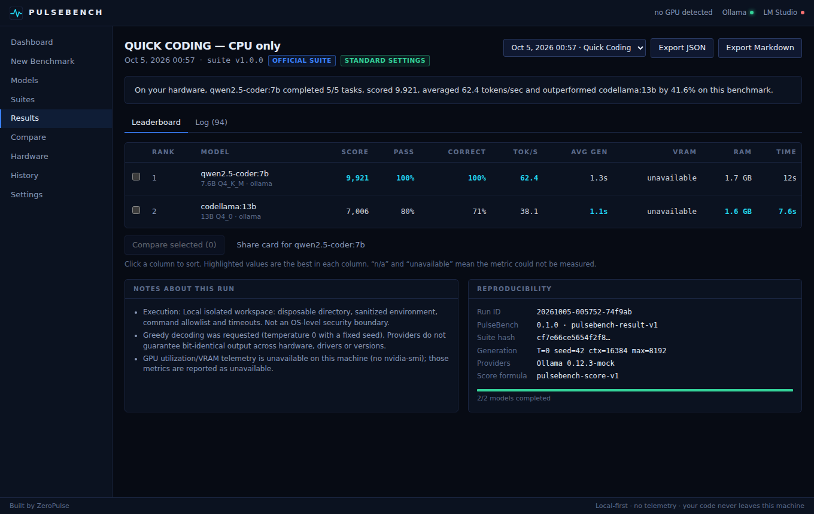
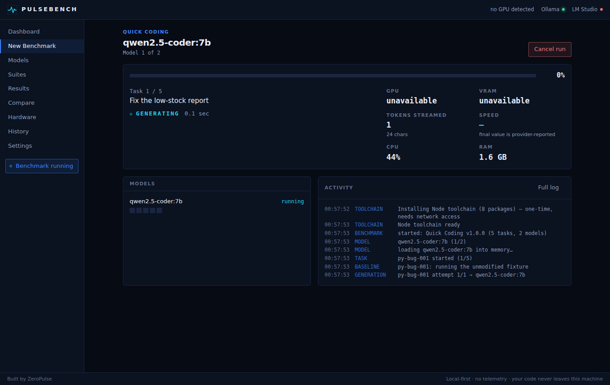
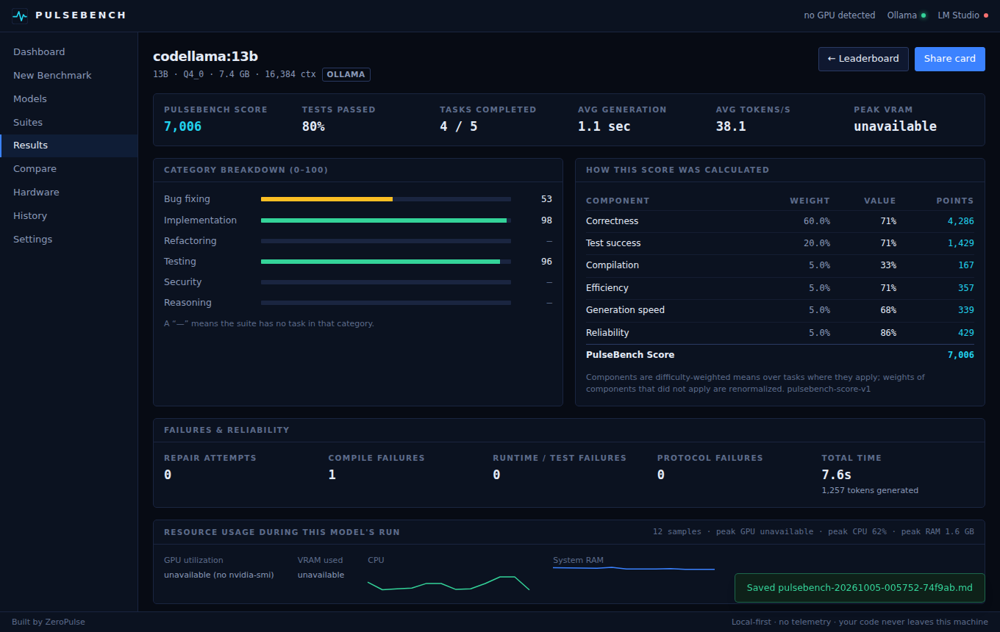
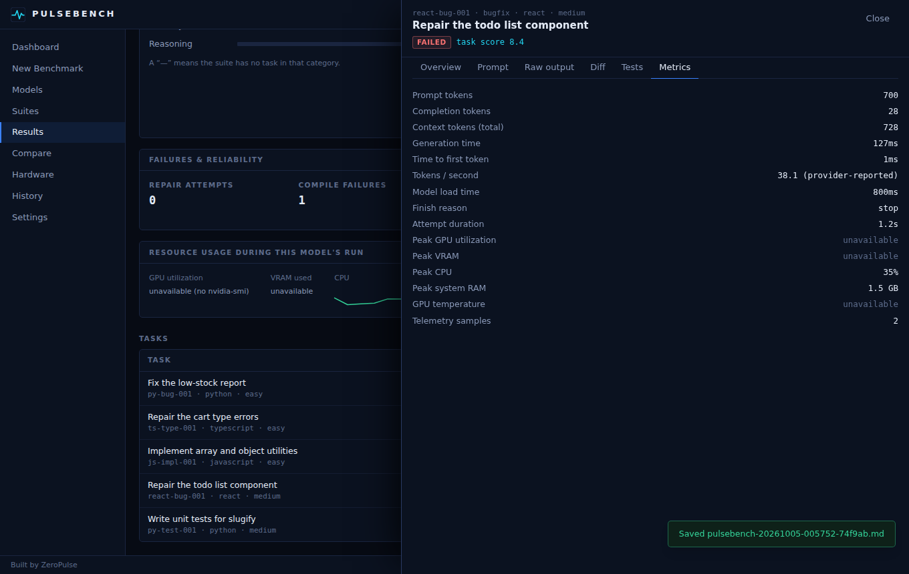
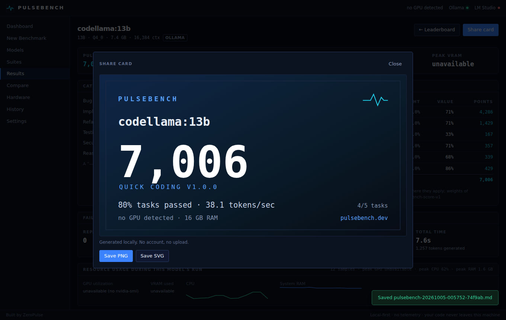

# PulseBench

**Real coding benchmarks. On your hardware. With your models.**

PulseBench runs local AI coding models against real software-engineering tasks, executes their
solutions, verifies them with tests, measures performance and produces reproducible scores.
It is a desktop app (Tauri 2 + Rust + React) with a CLI that shares the same engine.

<p align="center">
  <!-- Replace with a hero banner (1600×500) before the public launch. -->
  
</p>

> *"On your RTX 3070 Ti, Qwen3-Coder completed 18/20 tasks, scored 8,742, averaged 42.1 tokens/sec and
> outperformed DeepSeek by 6.4% on this benchmark."* — that sentence is generated from measured data
> for every run (the numbers above are an example; yours come from your machine).

## What it does

1. Detects your hardware (GPU, VRAM, CPU, RAM) and your local model providers (**Ollama**, **LM Studio** / any OpenAI-compatible server).
2. Lists the models you actually have installed. Nothing is hard-coded.
3. Gives **every model the identical tasks**: same prompt text, same files, same limits, same tests.
4. Writes each model's answer into a **fresh disposable workspace**, then runs the *benchmark's own* compile and test commands. Models never choose what gets executed.
5. Scores each model with a transparent formula (0–10,000), ranks them, and keeps the full evidence: prompt, raw output, diff, test output, token and timing metrics, GPU/VRAM/CPU/RAM samples.
6. Stores history in SQLite, exports JSON (`pulsebench-result-v1`) and Markdown, and renders a share card.

| | |
|---|---|
|  |  |
|  |  |

*The screenshots are produced by the repository's UI end-to-end test (`npm run e2e`). It drives the real
backend, sandbox and test execution but uses a small mock Ollama HTTP server as the "model", so the answers are scripted and the
machine has no GPU. Your results come from your own models and hardware.*

## Install

**Windows (recommended):** download the installer from the [Releases](../../releases) page.
You also need at least one provider with a model:

```powershell
winget install Ollama.Ollama
ollama pull qwen2.5-coder:7b
```

PulseBench executes tasks with the interpreters on your machine, so install **Python 3.8+** and
**Node.js 20+** (Quick and Full contain Python, JavaScript, TypeScript and React tasks). Missing
runtimes are detected and the affected tasks are *skipped and reported*, never silently failed.
The first TypeScript/React run downloads a pinned toolchain (~50 MB, once).

**From source:**

```bash
git clone https://github.com/zeropulse/pulsebench && cd pulsebench
npm ci
npm run desktop:dev          # desktop app with hot reload (needs the Tauri prerequisites)
cargo run -p pulsebench-cli -- models
```

See [docs/development.md](docs/development.md) for prerequisites on each OS.

## Supported providers

| Provider | Discovery | Metadata | Sampling settings | Token metrics |
|---|---|---|---|---|
| **Ollama** (`http://localhost:11434`) | `/api/tags`, `/api/show`, `/api/ps` | size, params, quantization, context, architecture, loaded state | temperature, seed, context, max tokens | provider-reported (`eval_count`/`eval_duration`) |
| **LM Studio** (`http://localhost:1234/v1`) | `/v1/models` + `/api/v0/models` | quantization, architecture, max context, loaded state | temperature, seed, max tokens (context = load-time value) | usage from stream; speed client-measured if the server omits it |
| **Any OpenAI-compatible endpoint** | `/v1/models` | id only | as above | as above |

Metrics a provider does not report are stored as `null` and shown as *n/a*. llama.cpp, vLLM and hosted
APIs fit the same `InferenceProvider` trait; see the [roadmap](docs/roadmap.md).

## Benchmark suites

| Suite | Tasks | Languages | Typical time | Purpose |
|---|---|---|---|---|
| **Quick Coding** v1.0.0 | 5 | Python, JS, TS, React | 5–15 min | bug fix, type error, utility implementation, component repair, test writing |
| **Full Coding** v1.0.0 | 20 | Python, JS, TS, React | 30–90 min | bug fixing, implementation, refactoring, testing, security, multi-file reasoning; repair attempts allowed |

Every task is a **runnable project with tests**. Each task ships a reference solution, and CI proves that
the untouched fixture *fails* and the reference solution *passes* (`pulsebench suite validate`). Official suites
have a lock file: changing any task without bumping the suite version fails CI, so historical scores stay meaningful.
You can build your own suites: [docs/creating-suites.md](docs/creating-suites.md).

## Methodology (short)

* **Fairness** — identical system prompt, user prompt, files, attempt count, timeout, context and tests for every model; deterministic decoding requested (temperature 0, seed 42). The full configuration is stored with each result. PulseBench does not claim bit-identical output: providers don't guarantee it across hardware or drivers.
* **Protocol** — models answer with `{"changes":[{"path","content"}],"explanation"}`. The parser recovers from markdown fences, surrounding prose, unescaped newlines, `<think>` blocks and single-code-block answers, and **records how it had to recover**; recovery lowers the *reliability* component. Paths outside the task's editable files are rejected.
* **Verification** — compile/type-check, then tests. "Write tests" tasks are graded by *mutation*: the model's tests must pass on the correct code and fail on every deliberately broken variant.
* **Isolation** — see [docs/security-model.md](docs/security-model.md). Local mode is a disposable directory with a sanitized environment, command allowlist, timeouts and process-tree kills; it is **not** an OS security boundary. Docker mode (`--network none`) is available when a Docker daemon is running.

Details: [docs/methodology.md](docs/methodology.md).

## Scoring

`PulseBench Score = 10,000 × Σ weightᵢ · componentᵢ / Σ weightᵢ`, using difficulty-weighted means over tasks.

| Component | Default weight | Meaning |
|---|---:|---|
| Correctness | 60 | tasks fully solved |
| Test success | 20 | share of tests passing (partial credit); mutants killed for test-writing tasks |
| Compilation | 5 | compile / type-check succeeded |
| Efficiency | 5 | solved on the first attempt scores highest |
| Generation speed | 5 | tokens/s on a log scale (5 → 0, 100 → 1) |
| Reliability | 5 | clean structured output (recovered output scores 0.5, failed/truncated 0) |

Weights are configurable (Settings → Benchmark → Scoring); changing them marks the run non-standard.
Components that do not apply (e.g. speed when the provider reports no token counts) are dropped and the rest renormalized — never counted as zero.
See [docs/scoring.md](docs/scoring.md).

## CLI

```text
pulsebench models                                  # providers + installed models
pulsebench hardware                                # GPU, CPU, RAM, runtimes, Docker
pulsebench suites
pulsebench run quick --model qwen3-coder:30b
pulsebench run full --models qwen3-coder:30b,deepseek-coder
pulsebench run quick -m lmstudio/qwen3-coder-30b --task py-bug-001,ts-type-001 --temperature 0
pulsebench history
pulsebench show RUN_ID
pulsebench export RUN_ID --format markdown -o report.md     # json | markdown | svg
pulsebench suite validate benchmarks/quick                  # prove tasks are sound
```

```text
QUICK CODING v1.0.0 — NVIDIA GeForce RTX 3070 Ti
RANK MODEL                              SCORE   PASS    TOK/S     TIME
───────────────────────────────────────────────────────────────────────
1    qwen2.5-coder:7b                    9921   100%     62.4      13s
2    codellama:13b                       7006    80%     38.1     7m 8s
```
*(Illustrative layout; rows are produced from real runs.)*

## Architecture

```text
 ┌────────────── React 19 UI (Vite, Tailwind, Zustand) ───────────────┐
 │  typed IPC (apps/desktop/src/ipc)        ◄── generated TS types ───┤
 └───────────────┬────────────────────────────────────────────────────┘
        Tauri command `rpc`  /  headless bridge (dev + UI tests)
 ┌───────────────▼──────────────┐       ┌─────────────────────────────┐
 │ pulsebench-app  (service)    │◄──────┤ pulsebench-cli  (same API)  │
 └──┬─────────┬────────┬────────┘       └─────────────────────────────┘
    │         │        │
 benchmark-core  providers  storage ── SQLite + migrations
 (suites, prompts,  (Ollama, OpenAI-compatible,   telemetry ── nvidia-smi, sysinfo
  protocol, runner)  trait InferenceProvider)     sandbox   ── workspaces, exec, Docker
        └── scoring ──┘     types ── Rust types → TypeScript + JSON Schema
```

Crates live in [`crates/`](crates), the UI in [`apps/desktop`](apps/desktop), benchmark content in
[`benchmarks/`](benchmarks), public schemas in [`packages/benchmark-schema`](packages/benchmark-schema).
More in [docs/architecture.md](docs/architecture.md).

## Privacy

No telemetry, no accounts, no uploads. Source code, prompts and results stay on your machine.
Provider API keys (only for custom endpoints) are stored locally and never exported.

## Status & verification

Read [docs/VERIFICATION.md](docs/VERIFICATION.md) for exactly what has been verified, with which tools, and
what still needs verification on real hardware (real Ollama/LM Studio, NVIDIA telemetry, the Windows installer, Docker mode).

## Contributing

Bug reports, new benchmark tasks and provider adapters are welcome: [CONTRIBUTING.md](CONTRIBUTING.md).
Security issues: [SECURITY.md](SECURITY.md).

## Roadmap

macOS and Linux builds · llama.cpp / vLLM / hosted providers · public leaderboard with signed uploads ·
community suites · SWE-bench / HumanEval / MBPP adapters · quantization comparison · model regression tests ·
repository-specific and agent benchmarks. Details: [docs/roadmap.md](docs/roadmap.md).

---

Built by [ZeroPulse](https://zeropulse.dev) · MIT licensed.
